# Image_Captioning

Image captioning with ResNet50 and LSTM using keras library without applying attention mechanism. 
 

# Image Captioning Using Deep learning

***What can be learned from this single project:***

### from CV 
- handling image data
- CNN models and uses
- transfer learning 
- Feature extraction

### from NLP
- handling text data
- word embedding
- one-hot-encoding
- BLEU score
### others
- greedy search
- beam search
- CrossEntropy loss 
- adam optimizer
- some unique visualization technique
- encoder-decoder models
- building deep learning models using keras
- object oriented concept of python
- handling many py files
- how to use google colab efficiently


## **RED ALARTS:**

  If you are a beginner , please follow the steps described below-
Fristly go throuth the slides attached with this repo once( you will hardly get anythig but just go through it and try to keep those figures and key-words in mind) then read some blogs and go through some video (I will add link to my blog here very soon , till then some useful github repo( not to follow the codes , just to go through the readme files), some blogs(for the basics to understand about deep learning) , and some you-tube videos (primarily you cant get all the concepts , but that will help you , here is the over all range of work and a high overview of the whole project framework). Links are in the references section below.


## **POINTS TO BE NOTED:**

-  In my repo I tried to make codes simple to understand and commented almost in every important places and also tried to utilize Object oriented concept of python and used them in py files for easy use. But for the beggeners it is hard to understand those , so I also will attach 2 ipynb files(jupytor notebook) (apart from these py and ipynb files)  very soon so that you can get everything by your own and you will find it in the folder "All_in_jupytor_notebook".Inside the py files I mentioned where you might get stucked and can get erros etc. 

-  I was initially writting the codes in google-colab, there a single tab(tab in keyboard '<--') is equvalent to 2 spaces('__ ' ) but in upyter noteboook a single tab is equvalent to 4 spaces . So I had to suffer a lot for that. You can see the codes written in jupytor notebook in the file named "visualization.py" , and probably other files are written in colab. So dont suffer from it,practice with the jupytor-notebook one.

* 

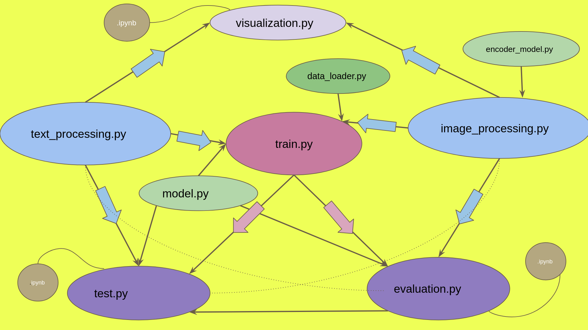

* 
```
 we have total 9  py files [text_processing.py ,image_processing.py ,
 encoder_model.py ,visualization.py , model.py , data_loadre.py , train.py ,
  evaluation.py , test.py] and 3 ipynb files [visualization.ipynb , 
  conclusion.ipynb,test.ipynb ]. And some folders[ data(where dataset should be there), 
  images (this images are for the readme files you dont need these), 
  pickle_files(the dumped or saved files will be there), 
  output15(for saving the weights and training loss and accuracies for 15 epochs ) ,
  output50, all_in_one(this folder is seperate from the rest, because I planed to give
  only some ipynb files for the beginners so that they need not bother with the py files
  initially for better understanding )]
```

Now come to the topic.__IMAGE CAPTIONING__

## Objective:
Our objective is to get a caption from an image. So we need to supply just an image.And the model ( as we will make it learned about the task ) will automatically gnerates a caption which is sifficient to describe the picture. so,the image ilastrate the fact that how human creat a caption. They find some key-points or spacial important objects and then using language or terminologies they put those in a sequence for a meaningful sentence.This is shown here:-
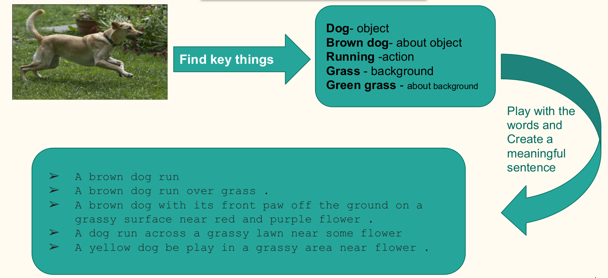

## Dataset:
I have used here Flickr8k data [Flickr8k_Dataset.zip](https://github.com/jbrownlee/Datasets/releases/download/Flickr8k/Flickr8k_Dataset.zip)and[Flickr8k_text.zip](https://github.com/jbrownlee/Datasets/releases/download/Flickr8k/Flickr8k_text.zip) , where you can find 2 different folder one of them containing 8000 images and another text-folder containg details about the images( actually the corresponding captions, 5 cations per image). We have 6000 traing images, 1000 vaidation imaged and 1000 test images. Here are some 

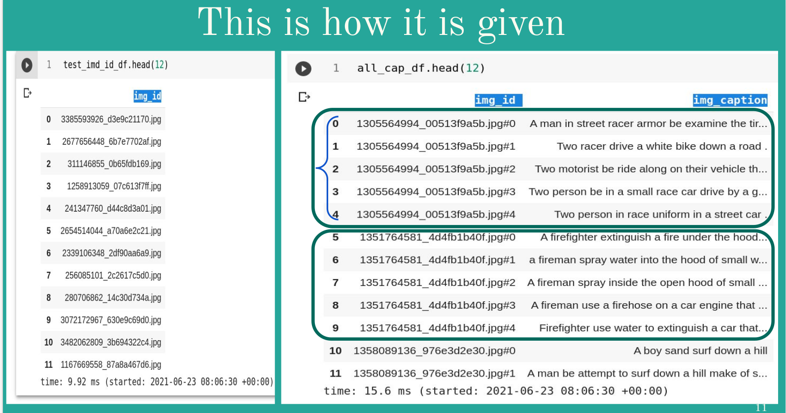


- Now we will see how the images and the captions are related and given.

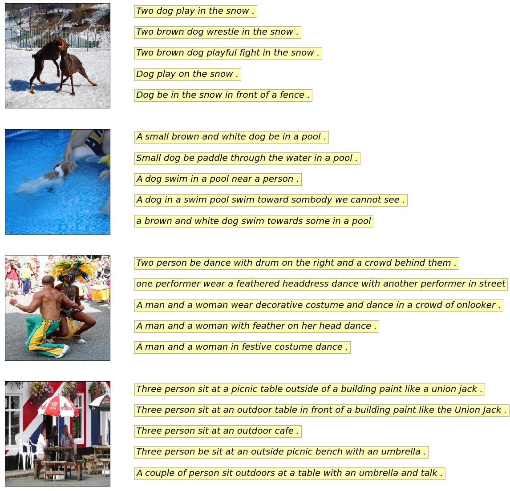


- Now we will move to the text data ,here we see what are the words present there mostly and some words that occured once in the whole training dataset.

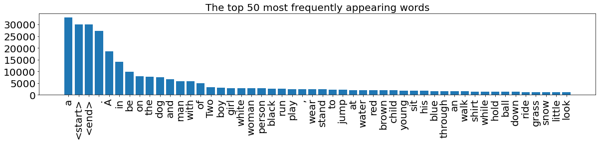

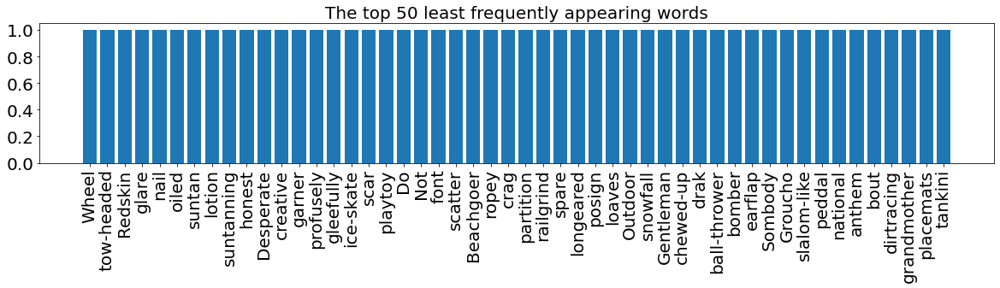

- Here you can see , there are many words which occured many times in the bag of the words from all the captions,and those words are very general,like prepositions,articles and common objects

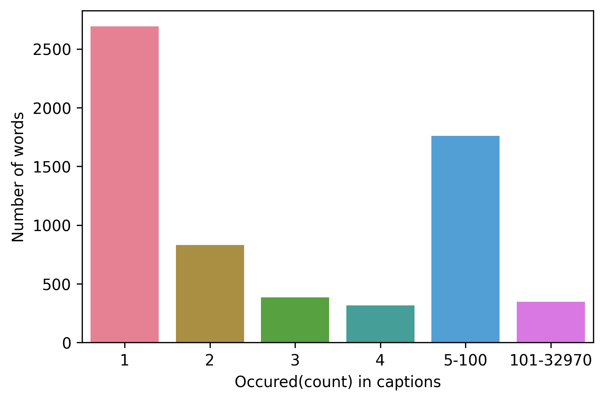


## Overview:
We can see the overall frame of the models.How image is processed for the next model to be fed.

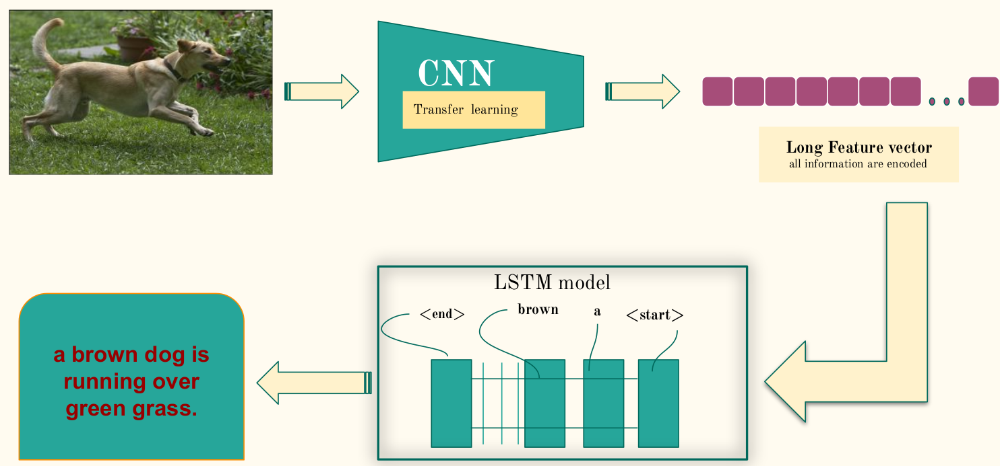


So we have our data with us,now we need to seperate it into 3 parts ,i.e, train,test,and validation but in our case the dataset is already splited ( you can find that detils in the text files). So , using the train set we train the model and at the same time using the validation data we validate the model and lastly to know the performance of our model we test it with the test dataset. The process of traing and validation is described below...


* while training how text are also being used is shown in the figure
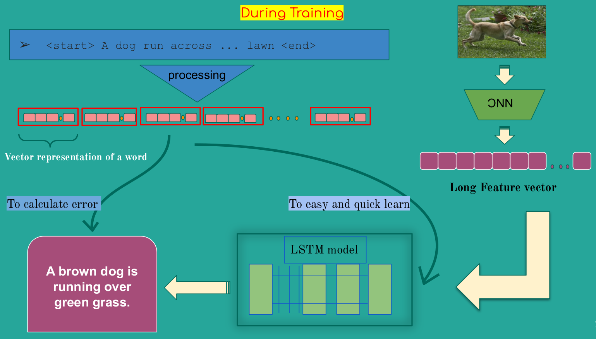


__Fristly__ ,to train the model we need the 6000 image and their (6000 * 5 =) 30,000 captions. Now we need to prepare both the image and the text,but how to prepare and what to prepare. OK! As computer or you can say our model can't understand the image or text data so, we need to represent those images and text as some mathematical vectors and here comes the concept of feature extraction ( for image) and word embedding (for text). Now, to get the feature we need to use any of the smart [CNN](https://medium.com/@RaghavPrabhu/understanding-of-convolutional-neural-network-cnn-deep-learning-99760835f148) model to extract all the image information by a vector.TO do this we need to build another CNN model , need t train that  and that will become another seoerate project, but as of now we have another advanced technique called [TRANSFER LEARNING](https://towardsdatascience.com/transfer-learning-with-convolutional-neural-networks-in-pytorch-dd09190245ce) by which we can use any pre-trained CNN model(i.e, the model is already trained for another work ,say,for classification problem ResNet,Vgg16,Vgg19 and many others are already traned with ImageNet dataset) will will use that model ( here [ResNet50](https://www.youtube.com/watch?v=mGMpHyiN5lk)} ). To get the feature vector for an image we need to exclude the last layer of those models because the last layer is used to classify the data nothing else. So image shold be preiously processed so that that can be taken as input in the ResNet50 model.Nothing to do here, by using some inbuild library we have to resize it and make the datatype same to thatof the CNN model.  The work for image is dine now. And this CNN model often called as encoder model.  

*  
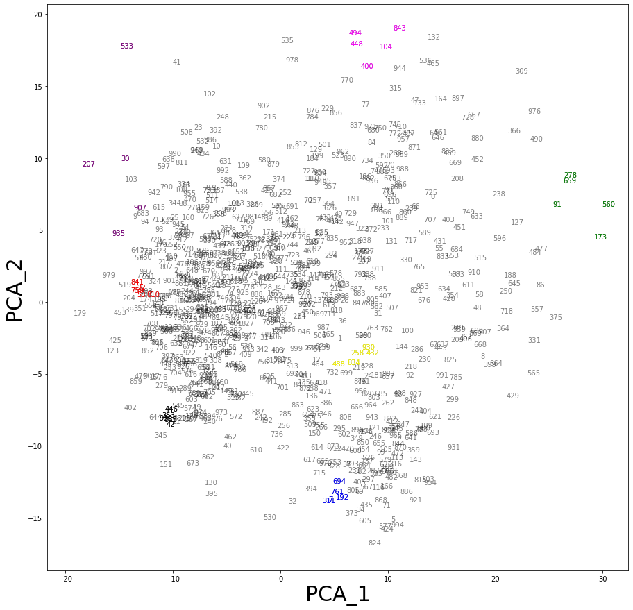

*  
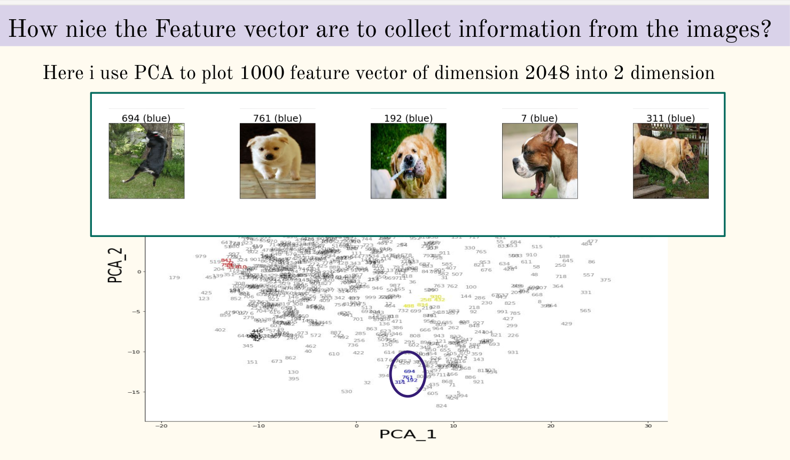

*  
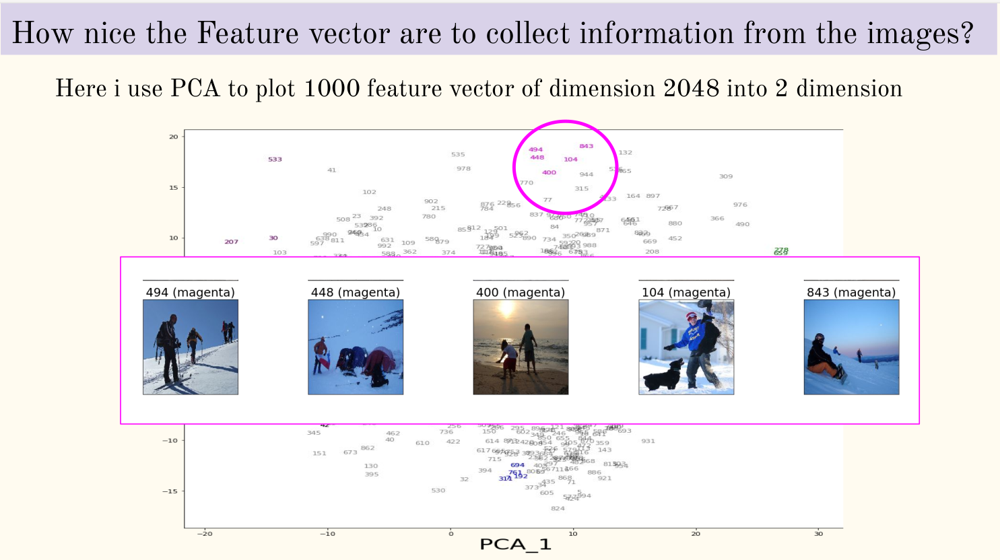

- __Now__ we have to prepare the text data , so there are multiple ways for word embedding. USe any of them , here I have used one-hot-encodng for that work. See the codes for better understanding after going through the reffered materials. We have  different spproaches to train the model, 

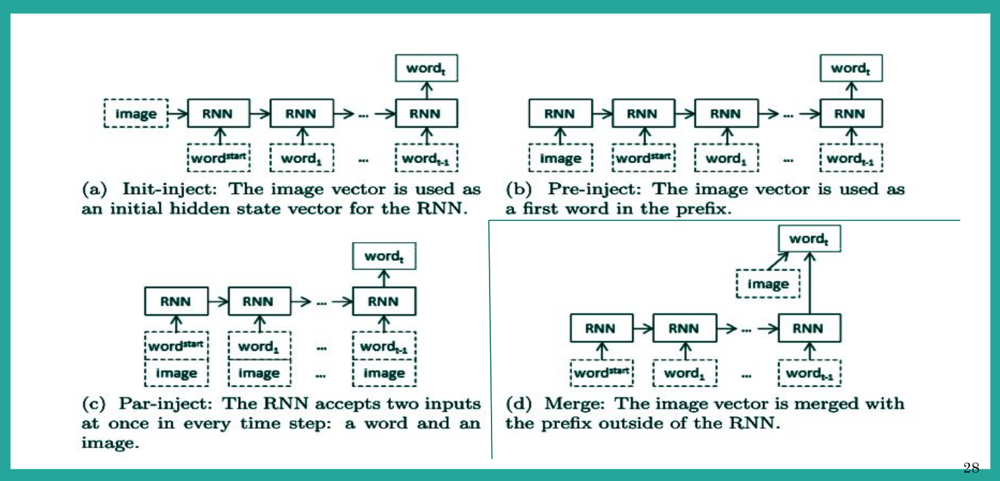

- we will use the  third one where a single image feature vector and a partial sequence of a caption will be sent in the decoder model,i.e, [LSTM model](http://colah.github.io/posts/2015-08-Understanding-LSTMs/) ( this model is called decoder model because it kind of decods the hidden information of  an image ) . SEE the pictures , how the data is being passed for training..

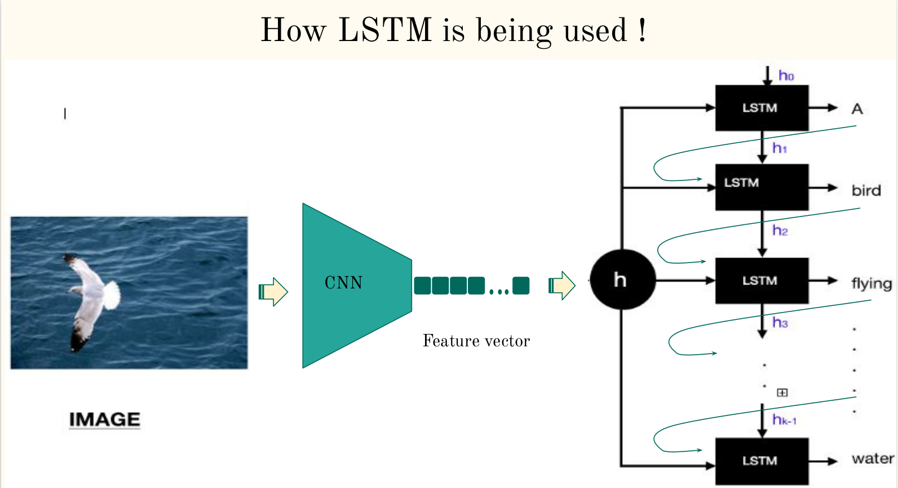
 
We will evaluate our model by [BLEU score](https://machinelearningmastery.com/calculate-bleu-score-for-text-python/#:~:text=The%20BLEU%20metric%20ranges%20from,will%20not%20necessarily%20score%201.)
## Inference:

If you want to run the codes from this repo you have to use the following commands,

You need to clone the repo, use this command in terminal 


```
git clone https://github.com/mahendranandi/Image_Captioning.git
```

if you want to clone it from jupyter notebbok or from google colab youjust need to put an exclaimanation mark before any command you are usuing in terminal
For an example , to clone the repo you need to use 


```
!git clone https://github.com/mahendranandi/Image_Captioning.git
```

First to visualize the dataset go to the visualization.ipyb file. 

Next, follow carefully. I have used pickle to dump(,i.e, saved locallly) some file for quick use. To do this you have to run the two preprocessin py files so that you need not use them multiple times.( If you want to use these pickle files further please visit the py files where I have commented out those and you comment in those lines )
Though I am again giving the codes here, I have used the same codes in conclusion.py for you. Go there for better understanding.

- For saving the files of text processing ,--

```
!python3 text_processing.py
```
(NOTE: if python3 is notworking use python)

- And for saving the files of image processing ,--

```
!python3 image_processing.py
```

#### TRAINING:
 (some short language have been used in different places in the ipynb files for me to identify , if you find dificulty to understand...  5060 means 50 epochs with batchsize 60 and 1530 means 15 epochs but batch size 30. Though these are used in folder name , i have used epochs no other than these also.
- Even if you havn't run the above 2 codes, dont worry these are not going to use in the next command, i.e, command for training ( visit conclusion.py file)


```
!python3 train.py
```
( the other parameters are set by default, if you wish to change them go to train.py file and read the help for each argparser and change accordingly in the command) 
For example if you want to change the no of epochs to 55 then you have to use 

```
!python3 train.py -epochs 55
```
( here the word 'epochs' is fixed because it is mentioned as 'epochs' in the argument parser and you can not use other words like 'epoch' or anything else.

- Similarly for evaluating the model use

```
!python3 evaluation.py
```
- and finally go to the test.ipynb for visualization and see the model-generated captions.

## Some Results:
- Train loss and validation loss with 50 epochs and batch size wit h60 and 30.
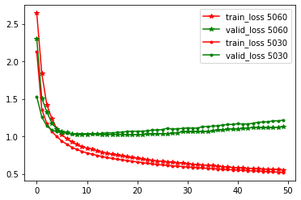
- Some example of generated captions with their score.{ here greedy search and [beam search](https://towardsdatascience.com/an-intuitive-explanation-of-beam-search-9b1d744e7a0f#:~:text=Beam%20search%20is%20the%20most,the%20sub%2Doptimal%20Greedy%20search.) are two different types of search technique for selecting the next word in an incomplete or parltial caption, greedy search selects the word with heighest probability and beam search select the word that will make the whole sentence optimal ,i.e, best among any the other sentence that can be produced from that output. 
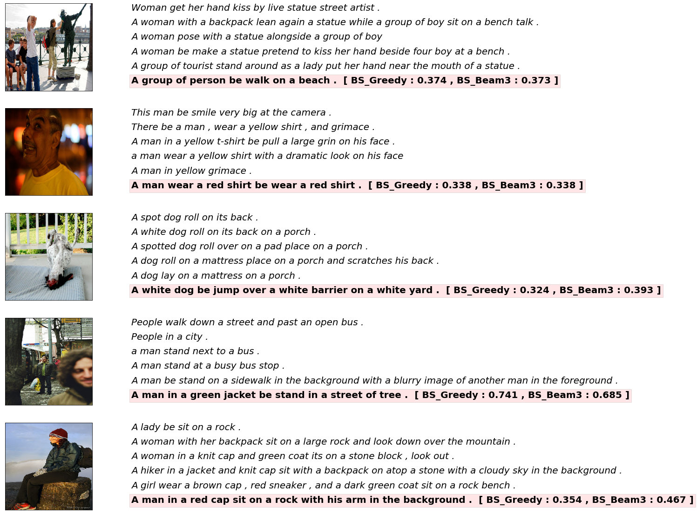

- Some captions with good BLEU score
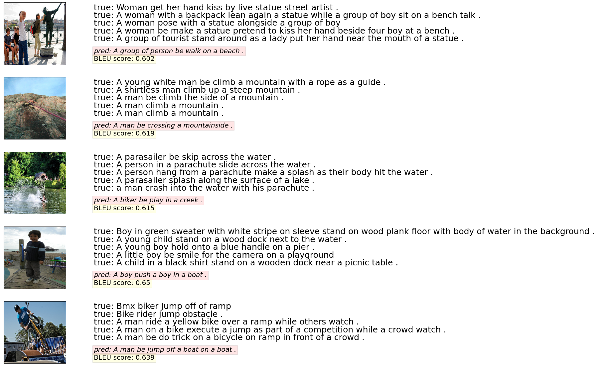

- Some captions with low BLEU score
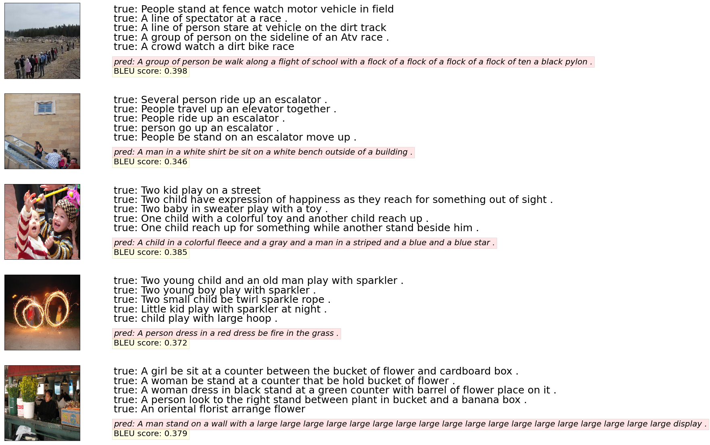
- In my case average BLEU score is 0.48 that is 48% which is good enough.

## References:

❖ https://medium.com/@raman.shinde15/image-captioning-with-flickr8k-dataset-bleu-4bcba0b52926#:~:text=BLEU%20stands%20for%20Bilingual%20Evaluation,quality%20of%20our%20generated%20caption.&text=It%20is%20easy%20to%20compute.

❖ https://towardsdatascience.com/bleu-bilingual-evaluation-understudy-2b4eab9bcfd1

❖ https://github.com/sgrvinod/a-PyTorch-Tutorial-to-Image-Captioning

❖ https://github.com/yudi09/pytorch-image-captioning

❖ https://github.com/yurayli/image-caption-pytorch

❖ https://github.com/tatwan/image-captioning-pytorch

❖ https://github.com/ruotianluo/ImageCaptioning.pytorch/tree/bart

❖ https://github.com/MITESHPUTHRANNEU/Image-Caption-Generator

❖ https://github.com/nalbert9/Image-Captioning

❖ https://towardsdatascience.com/an-intuitive-explanation-of-beam-search-9b1d744e7a0f#:~:text=Beam%20search%20is%20the%20most,the%20sub%2Doptimal%20Greedy%20search.


